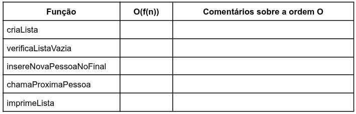

## Questão 1
Você foi contratado para resolver um problema no Banco da Praça. Lá, na hora de ser atendido, as pessoas estavam reclamando que as preferências não estavam sendo
atendidas. Assim, o time de devs propôs uma solução: as senhas já seriam geradas com um valor inteiro que indica a preferência daquela pessoa na lista. Assim, era só chamar a maior prioridade para o atendimento e o problema estaria resolvido. Em caso de empate de prioridades, quem estava primeiro na lista seria chamado, pois já estavam lá esperando há mais tempo. Este foi o TAD que a equipe criou:

#### TAD: Lista de Prioridades

| Operação | Descrição |
| :--- | :--- |
| **Conjunto de Pessoas** | Conjunto das senhas e nomes das pessoas na lista. A senha é a própria prioridade. |
| **Cria lista** | Cria uma nova lista. |
| **Verifica Lista Vazia**| Verifica se a lista está vazia. |
| **Insere Nova Pessoa no Final** | Insere uma nova pessoa no final da lista. |
| **Chamar Próximo da Lista** | Chama a próxima pessoa da lista e a remove. Em caso de empate, vale a primeira senha encontrada. |
| **Imprime Lista** | Imprime o estado atual da lista, com nomes e prioridades de cada um presente nela. |

A equipe já criou até a interface, colocando num arquivo .h. Só que deu 18h de
sexta-feira, e como você chegou atrasado hoje, perdeu a lista do Happy Hour e vai ter que implementar tudo sozinho até o começo do dia seguinte, garantindo que tudo funcione perfeitamente! Para isso, você terá que implementar as funções do arquivo listaPrioridades.h no arquivo listaPrioridades.c, de acordo com as especificações exatas que estão no arquivo .h.

## Questão 2
Depois de tudo implementado, agora você precisa apresentar os testes que você fez para mostrar que sua estrutura funciona. Crie um arquivo main.c que inclua o .h da sua lista, crie a função main, e realize a sequência de instruções abaixo. Coloque no relatório um print com a saída do terminal com todas as saídas.

- criaLista() com tamanho máximo 10
- insereNovaPessoaNoFinal() com prioridade 1 e nome Beltrano
- insereNovaPessoaNoFinal() com prioridade 10 e nome Fulano
- insereNovaPessoaNoFinal() com prioridade 9 e nome Sicrano
- insereNovaPessoaNoFinal() com prioridade 11 e nome Beraldo
- insereNovaPessoaNoFinal() com prioridade 99 e nome Zutano
- imprimeLista()
- chamaProximaPessoa()
- imprimeLista()
- chamaProximaPessoa()
- imprimeLista()
- chamaProximaPessoa()
- imprimeLista()
- chamaProximaPessoa()
- imprimeLista()
- chamaProximaPessoa()
- imprimeLista()
- chamaProximaPessoa()

## Questão 3
Agora, após os testes, você precisa documentar toda a sua solução. Para isso, coloque no relatório uma tabela como a tabela abaixo. Nela, para cada função, você precisa adicionar a complexidade em notação $O$, e os comentários de como concluir que esta é a complexidade $O$ da sua função.

Essas funções são as mínimas necessárias e suas assinaturas não podem ser modificadas. Se você precisar de alguma outra função extra, pode criá-la. Você também pode (talvez até deva) incluir os cabeçalhos de C para manipular entrada e saída, memória, strings, para usar as funções matemáticas, etc. Essas inclusões devem ser feitas só nos arquivos .c!
