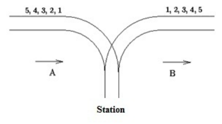

## Exercício 1

**Enunciado:**

Dada uma expressão matemática que contém parênteses, verifique se os parênteses `(` e `)` estão balanceados.  
Uma expressão é considerada balanceada se, para cada parêntese de abertura, houver um correspondente de fechamento em ordem correta.

**Exemplos:**

```
a+(b*c)-d        → correta
(a+b*(c-d))      → correta
)(               → incorreta
(a+b))           → incorreta
```

Seu programa deve ler várias linhas de expressões, uma por vez, até o final da entrada de dados (EOF).  
Para cada expressão lida, imprima `correct` se os parênteses estiverem balanceados ou `incorrect` caso contrário.

💡 **Dica:** Utilize uma estrutura de **pilha** para resolver este problema.

## Exercício 2

**Enunciado:**

Um geólogo precisa de ajuda para extrair diamantes de uma mina.  
Os diamantes são representados pelo par de caracteres `< >`. Ele encontrou várias amostras de solo, representadas por strings contendo os caracteres `.`, `<`, e `>`.

Sua tarefa é contar quantos diamantes podem ser formados em cada amostra.  
Um diamante é formado por um caractere de abertura `<` seguido, em algum momento, por um de fechamento `>`.  
Os caracteres de areia (`.`) devem ser ignorados. Cada `<` só pode ser usado para formar um diamante.

**Entrada:**

O programa deve primeiro ler um inteiro `N` indicando o número de casos de teste.  
Em seguida, para cada caso, deve ler uma string representando a amostra.

**Saída:**

Imprima o número total de diamantes que podem ser extraídos.

**Exemplo:**

```
Entrada:
2
<..><.<..>>
<<<><>>><

Saída:
3
4
```

## Exercício 3

**Enunciado:**

Escreva um programa que simule o descarte de cartas de um baralho.  
O baralho é composto por `n` cartas numeradas de 1 a `n`, com a carta 1 no topo e a `n` na base. A operação é repetida até que reste apenas uma carta:

1. Descarte a carta que está no topo do baralho.  
2. Mova a nova carta que está no topo para a base do baralho.

O programa deve ler vários valores de `n` (onde `1 <= n <= 50`).  
A entrada termina quando o valor lido para `n` for `0`.

Exemplo para n = 7:
    - Baralho inicial: 1, 2, 3, 4, 5, 6, 7
    - Descarta 1, move 2: 3, 4, 5, 6, 7, 2
    - Descarta 3, move 4: 5, 6, 7, 2, 4
    - ... e assim por diante.

**Saída esperada para n = 7:**

```
Discarded cards: 1, 3, 5, 7, 4, 2
Remaining card: 6
```

## Exercício 4 (Questão beecrowd 1062 adaptada)

Existe uma famosa estação ferroviária na cidade de EmpurraPuxa. O país é extremamente montanhoso, e a estação foi construída no século passado.
Infelizmente, os recursos disponíveis na época eram muito limitados, e só foi possível construir uma única linha de superfície. Além disso, a estação acabou sendo um beco sem saída, e, devido à falta de espaço, possui apenas um trilho.



A tradição local é que todo trem que chega pela direção A deve sair pela direção B, mas com os vagões reorganizados de alguma forma.
Considere que o trem que chega pela direção A possui N (≤ 1000) vagões, numerados em ordem crescente: 1, 2, …, N.

O chefe responsável pela reorganização precisa saber se é possível reordenar os vagões de forma que eles saiam na direção B com a ordem desejada:
a1, a2, …, an.

Ajude-o escrevendo um programa que determine se é possível obter a ordem desejada dos vagões.

#### Regras

- Os vagões podem ser desconectados individualmente do trem antes de entrar na estação.
- Eles podem mover-se sozinhos até a linha de saída (direção B).
- Em qualquer momento, quantos vagões forem necessários podem ficar dentro da estação.
- Uma vez que um vagão entrou na estação, ele não pode voltar para a direção A.
- Uma vez que um vagão saiu para a direção B, ele não pode retornar à estação.

#### Entrada

- A entrada é composta por blocos de linhas. Cada bloco (exceto o último) descreve um trem e as possíveis ordens desejadas para reorganizá-lo.
- A primeira linha de cada bloco contém o inteiro N, que representa o número de vagões.
- As linhas seguintes do bloco contêm permutação(es) dos números 1, 2, …, N, representando a ordem desejada de saída.
- A última linha de cada bloco contém apenas o número 0.
- A entrada termina quando N = 0.

```bash
5
5 4 3 2 1
1 2 3 4 5
5 4 1 2 3
0
6
1 3 2 5 4 6
0
0
```

#### Saida

Para cada permutação lida, imprima:

- Yes — se for possível obter a ordem desejada de saída.
- No — caso contrário.

Após cada bloco de testes, imprima uma linha em branco. Não deve haver linha correspondente ao bloco final “nulo” (quando N = 0).

```bash
Yes
Yes
No

Yes
```

## Exercício 5 (Baseado no arquivo `203-airport.c`)

**Enunciado:**

Um aeroporto precisa organizar o pouso de aviões que chegam de quatro direções diferentes (**Oeste**, **Norte**, **Sul**, **Leste**), cada uma com sua própria **fila de espera**.

O controlador envia uma série de códigos para o sistema:

- Um código como `-1`, `-2`, `-3`, ou `-4` indica a direção (Oeste, Sul, Norte e Leste, respectivamente).
- Todos os códigos de avião (ex: `A123`, `B456`) que chegarem depois de um código de direção serão enfileirados na fila dessa direção, até que um novo código de direção seja recebido.

Após o recebimento de todas as chegadas (sinalizado por uma entrada `0`), o sistema deve determinar a **ordem final de pouso**.

A ordem é feita em um ciclo:
- Um avião da fila Oeste,
- Um da Norte,
- Um da Sul,
- Um da Leste,
- Repetindo o ciclo e pulando filas vazias até que todas estejam vazias.

**Entrada:**
Sequência de códigos, um por linha.  
A entrada termina com `0`.

**Saída:**
Imprima a sequência final de pouso dos aviões em uma única linha, com os códigos separados por espaços.